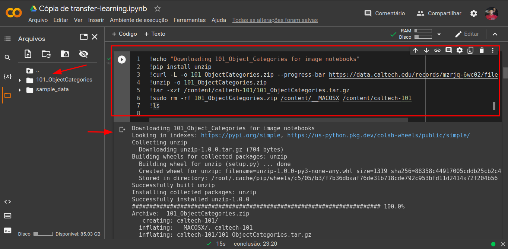
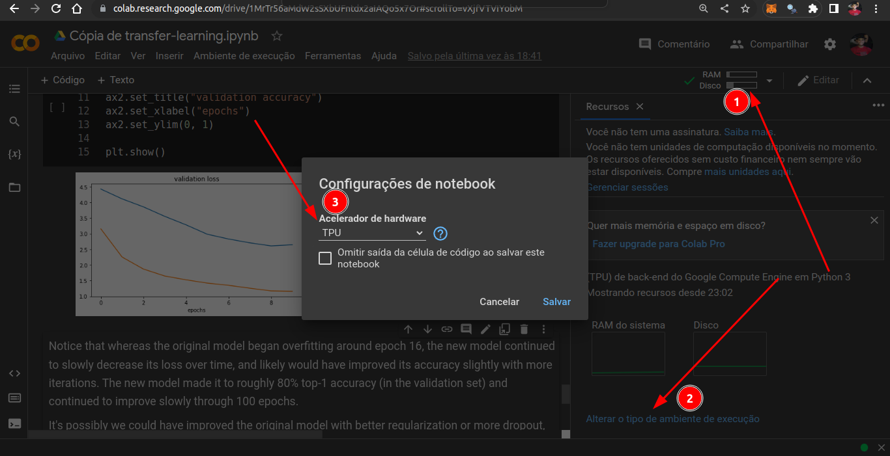

# Final Challenge DS DIO - Unimed-BH 

During the course we absorve a lot of knowlodges, and now we need implent a transfer learning (use of previously acquired knowledge and skills in new learning or problem-solving solutions).

## Project base ofer by DIO

Utilizaremos o [seguinte projeto](https://colab.research.google.com/github/kylemath/ml4a-guides/blob/master/notebooks/transfer-learning.ipynb) que realiza Transfer Learning com o Dataset do MNIST:

## Errors

When I try use the base project I deparet with some mistakes. I Bilieve it's because new update of files, and sites. Let's fix it.

1. Session "Getting a dataset" - Link to download dataset is invalid, appear the site update page and now we have option to download files to Mac OS too.

1.1 Fix it - Correct link of page: https://data.caltech.edu/records/mzrjq-6wc02
New command:
```
!echo "Downloading 101_Object_Categories for image notebooks"
!pip install unzip
!curl -L -o 101_ObjectCategories.zip --progress-bar https://data.caltech.edu/records/mzrjq-6wc02/files/caltech-101.zip?download=1
!unzip -o 101_ObjectCategories.zip
!tar -xzf /content/caltech-101/101_ObjectCategories.tar.gz
!sudo rm -rf 101_ObjectCategories.zip /content/__MACOSX /content/caltech-101
!ls
```


2. Fix function get_image:
2.1 For this we need change the import of keras. In lines of import change line 15 `from keras.preprocessing import image` to `from keras.utils import load_img, img_to_array` and in function:
```
def get_image(path):
    img = load_img(path, target_size=(224, 224))
    x = img_to_array(img)
    x = np.expand_dims(x, axis=0)
    x = preprocess_input(x)
    return img, x
```

3. When we let's quickly look at a few sample images from our dataset. one more time we use import like image.load_image, only you need do it's exclude the word and the dot `image.`

4. Error "All RAM used..." to fix it change type of processing to TPU.


5. Change the value when we plot a validation "val_acc" to`ax2.plot(history.history["val_accuracy"])` 
Note: A little more down we need change it again.

